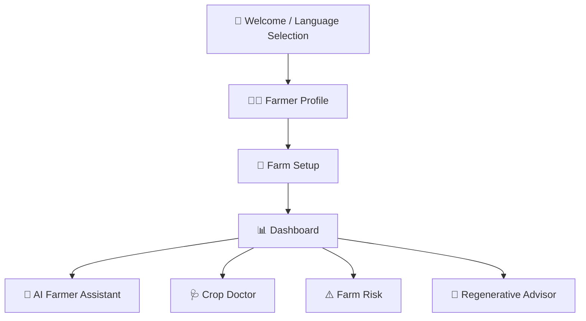
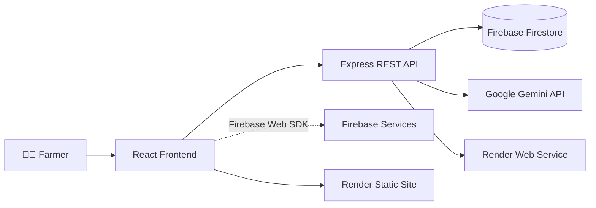

# 🌱 AgriN — Agricultural Intelligence Platform

<p align="center"><strong>AI-powered agricultural intelligence for smarter and more sustainable farming.</strong></p>

<p align="center">AgriN combines AI assistance, crop analysis, farm-risk assessment, and regenerative agriculture guidance in one farmer-friendly platform.</p>

<p align="center"><a href="https://agrin-ai-frontend.onrender.com/">🌐 Live Demo</a> · <a href="https://agrin-ai.onrender.com/">⚙️ API</a></p>

---

## 📌 Overview

**AgriN** is a full-stack agricultural intelligence platform built to help farmers make better farming decisions using modern web technologies, cloud services, and AI.

### Core capabilities

- 👨‍🌾 Farmer profile and farm setup
- 📊 Personalized farmer dashboard
- 🤖 AI Farmer Assistant
- 🩺 Crop Doctor / Crop Analyzer
- ⚠️ Farm Risk Assessment
- 🌿 Regenerative Agriculture Advisor
- 🌐 English and Hindi language support
- 🔥 Firebase / Firestore data storage
- 🚀 Production deployment using Render

---

## 🎯 Project Goal

AgriN brings several agricultural intelligence tools together in one accessible platform.

| Goal | Description |
|---|---|
| 🌱 Practical | Useful recommendations for real farming situations |
| 🤖 AI-assisted | AI-supported agricultural decision-making |
| 📊 Data-driven | Uses farmer and farm information for guidance |
| 🌐 Accessible | Simple interface with multiple language support |
| ♻️ Sustainable | Encourages regenerative and sustainable practices |

---

# ✨ Features

### 👨‍🌾 Farmer Profile & Farm Setup

Farmers can enter and manage their name, phone number, preferred language, farm information, land size/unit, soil type, irrigation type, location, and crop information.

### 📊 Farmer Dashboard

The dashboard is the main control center after farm setup and provides access to the major agricultural tools.

### 🤖 AI Farmer Assistant

Provides farmer-friendly agricultural guidance using the **Google Gemini API**, including farming, crop, soil, irrigation, and general agricultural questions. AI requests are handled through the backend.

### 🩺 Crop Doctor

AI-assisted crop analysis designed to help farmers understand possible crop problems, causes, and recommended actions.

### ⚠️ Farm Risk Assessment

AI-assisted assessment of potential agricultural risks, including severity, causes, preventive actions, and recommendations.

### 🌿 Regenerative Agriculture Advisor

Provides guidance focused on long-term farm health, including soil health, water management, sustainable practices, and regenerative agriculture.

---

# 🌐 Language Support

AgriN currently supports:

- 🇬🇧 **English**
- 🇮🇳 **Hindi**

---

# 🧭 Main User Flow



---

# 🏗️ System Architecture



| Layer | Responsibility |
|---|---|
| 🎨 React + Vite | User interface and frontend routing |
| 🎨 Tailwind CSS | Frontend styling |
| ⚙️ Express + Node.js | REST API and backend logic |
| 🔥 Firebase / Firestore | Application data storage |
| 🤖 Gemini | AI-powered agricultural features |
| 🚀 Render | Production hosting |

---

# 🛠️ Tech Stack

| Category | Technology |
|---|---|
| Frontend | React |
| Build Tool | Vite |
| Language | JavaScript |
| Styling | Tailwind CSS |
| Routing | React Router |
| Backend | Node.js + Express.js |
| Database | Firebase Firestore |
| Firebase Server | Firebase Admin SDK |
| AI | Google Gemini API |
| API Testing | Hoppscotch |
| Version Control | Git + GitHub |
| Deployment | Render |

---

# 📁 Project Structure

<details>
<summary><strong>📂 Click to expand</strong></summary>

```text
AgriN/
│
├── public/
├── src/
│   ├── components/
│   │   ├── navigation/
│   │   │   └── AppShell.jsx
│   │   └── ...
│   ├── pages/
│   │   ├── Welcome.jsx
│   │   ├── Profile.jsx
│   │   ├── FarmSetup.jsx
│   │   ├── Dashboard.jsx
│   │   ├── CropDoctor.jsx
│   │   ├── FarmRisk.jsx
│   │   ├── RegenerativeAdvisor.jsx
│   │   └── FarmerAssistant.jsx
│   ├── services/
│   │   └── api.js
│   ├── config/
│   ├── context/
│   ├── locales/
│   ├── utils/
│   ├── App.jsx
│   ├── App.css
│   ├── index.css
│   └── main.jsx
│
├── server/
│   ├── config/
│   │   └── firebase.js
│   ├── controllers/
│   │   └── farmerController.js
│   ├── routes/
│   │   └── farmerRoutes.js
│   ├── services/
│   │   └── farmerService.js
│   ├── middleware/
│   ├── utils/
│   └── server.js
│
├── .gitignore
├── package.json
├── package-lock.json
├── vite.config.js
└── README.md
```

</details>

---

# 🧭 Application Routes

| Route | Feature |
|---|---|
| `/` | Welcome / Language Selection |
| `/profile` | Farmer Profile |
| `/farm-setup` | Farm Setup |
| `/dashboard` | Farmer Dashboard |
| `/crop-doctor` | Crop Doctor |
| `/risk` | Farm Risk |
| `/improve` | Regenerative Advisor |
| `/assistant` | AI Farmer Assistant |

---

# 🔥 Firebase & Firestore

AgriN uses **Firebase Firestore** for application data storage. The backend uses the **Firebase Admin SDK** to communicate with Firestore.

### `farmers`

```text
id
name
phone
language
location
createdAt
updatedAt
```

### `farms`

```text
id
farmerId
farmName
landSize
landUnit
soilType
irrigationType
location
createdAt
updatedAt
```

---

# 🔌 Backend API

### Local

```text
http://localhost:5000
```

### Production

```text
https://agrin-ai.onrender.com/
```

### Example Farmer Endpoints

```http
POST /api/farmers
GET  /api/farmers/:farmerId
PUT  /api/farmers/:farmerId
```

### Example Farm Endpoints

```http
POST /api/farmers/farm/create
GET  /api/farmers/:farmerId/farms
```

Additional routes are implemented for the AI and agricultural features.

---

# 🚀 Deployment

AgriN is deployed on **Render** using separate frontend and backend services.

### 🌐 Frontend

**Live Application:**

https://agrin-ai-frontend.onrender.com/

### ⚙️ Backend

**Production API:**

https://agrin-ai.onrender.com/

```text
GitHub Repository
       │
       ├───────────────┐
       ▼               ▼
Render Static Site   Render Web Service
       │               │
       ▼               ▼
React Frontend       Express Backend
       │               │
       └─────── API ───┘
                       │
                ┌──────┴──────┐
                ▼             ▼
           Firestore       Gemini
```

---

# 💻 Local Development

### 1. Clone

```bash
git clone <YOUR_GITHUB_REPOSITORY_URL>
```

### 2. Enter the project

```bash
cd agrin-ai
```

### 3. Install dependencies

```bash
npm install
```

### 4. Start frontend

```bash
npm run dev
```

Frontend: `http://localhost:5173`

### 5. Start backend

In another terminal:

```bash
npm run server
```

Backend: `http://localhost:5000`

---

# 🔐 Environment Variables

> ⚠️ Never commit real API keys, Firebase private keys, service-account credentials, or `.env` files to GitHub.

### Frontend

```env
VITE_API_URL=http://localhost:5000

VITE_FIREBASE_API_KEY=your_firebase_web_api_key
VITE_FIREBASE_AUTH_DOMAIN=your_firebase_auth_domain
VITE_FIREBASE_PROJECT_ID=your_firebase_project_id
VITE_FIREBASE_STORAGE_BUCKET=your_firebase_storage_bucket
VITE_FIREBASE_MESSAGING_SENDER_ID=your_messaging_sender_id
VITE_FIREBASE_APP_ID=your_firebase_app_id
```

### Backend

```env
PORT=5000

FIREBASE_PROJECT_ID=your_project_id
FIREBASE_CLIENT_EMAIL=your_client_email
FIREBASE_PRIVATE_KEY="your_private_key"

GEMINI_API_KEY=your_gemini_api_key
GEMINI_MODEL=your_gemini_model
```

### Production frontend

```env
VITE_API_URL=https://agrin-ai.onrender.com
```

Production variables are configured directly in Render.

---

# 🔒 Security

### Never commit

```text
.env
Firebase Admin private key
Firebase service-account credentials
Gemini API key
Private API credentials
```

Recommended `.gitignore` entries:

```gitignore
node_modules/
.env
.env.local
.env.production
dist/
```

---

# 🧪 API Testing

Backend APIs were tested during development using **Hoppscotch**.

Example successful response:

```json
{
  "success": true,
  "message": "Farmer created successfully",
  "data": {
    "id": "example-id",
    "name": "Example Farmer",
    "phone": "XXXXXXXXXX",
    "language": "en"
  }
}
```

---

# 📈 Project Status

| Component | Status |
|---|:---:|
| React + Vite | ✅ |
| Tailwind CSS | ✅ |
| Frontend Routing | ✅ |
| Farmer Profile | ✅ |
| Farm Setup | ✅ |
| Dashboard | ✅ |
| Express Backend | ✅ |
| REST APIs | ✅ |
| Firebase / Firestore | ✅ |
| Firebase Admin SDK | ✅ |
| AI Farmer Assistant | ✅ |
| Crop Doctor / Analyzer | ✅ |
| Farm Risk | ✅ |
| Regenerative Advisor | ✅ |
| English + Hindi | ✅ |
| Production Frontend | ✅ |
| Production Backend | ✅ |
| Render Deployment | ✅ |
| Frontend → Backend Connection | ✅ |

---

# 🗺️ Roadmap

### 🔜 Planned Improvements

- [ ] Real-time weather API integration
- [ ] Additional regional languages
- [ ] Voice-based AI Assistant
- [ ] Advanced crop disease detection
- [ ] Offline / low-connectivity support
- [ ] Personalized crop recommendations
- [ ] Government agricultural scheme information
- [ ] Market price information
- [ ] Advanced farm analytics
- [ ] Push notifications
- [ ] Automated testing
- [ ] Advanced AI personalization
- [ ] Further UI/UX refinement

---

# 👨‍💻 About the Project

**AgriN — Agricultural Intelligence Platform**

A full-stack agricultural technology project focused on solving real-world farming problems using:

**AI + Data + Cloud + Sustainable Agriculture**

---

# 🌱 AgriN

<p align="center"><strong>Smart technology for better farming decisions.</strong></p>

<p align="center">Empowering farmers with AI, data, and sustainable agriculture.</p>
